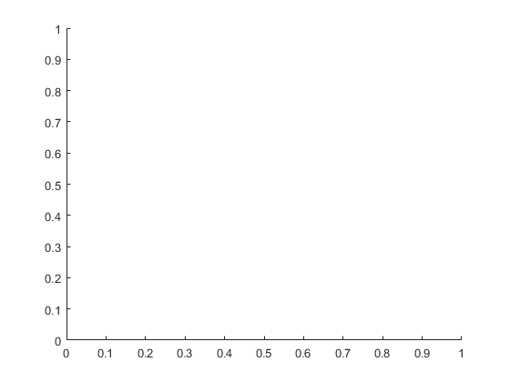
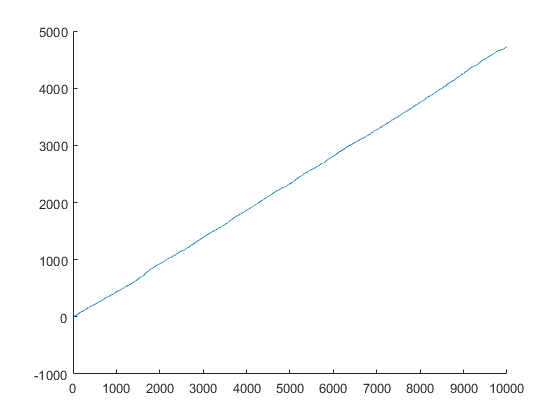
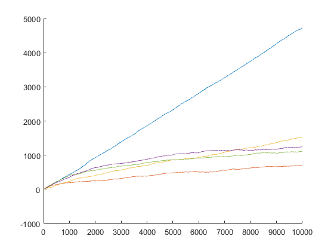
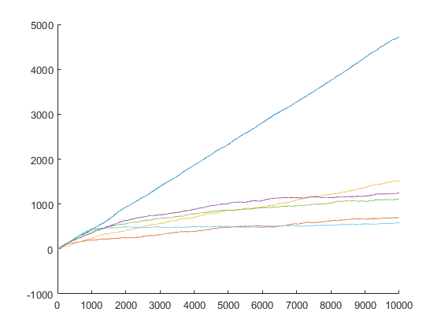
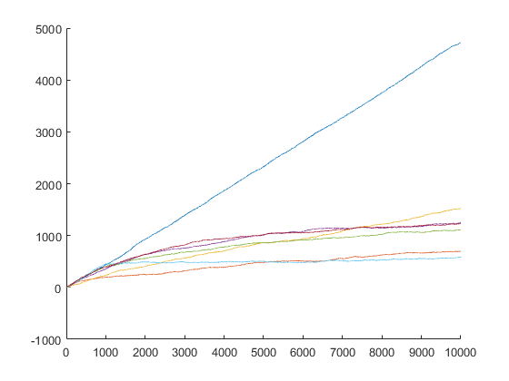
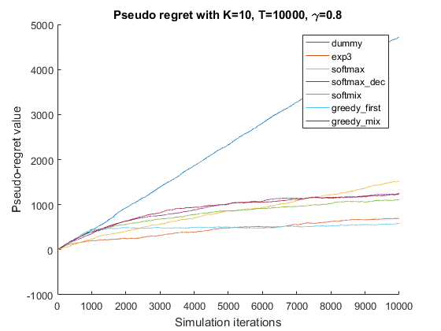

<!DOCTYPE html
  PUBLIC "-//W3C//DTD HTML 4.01 Transitional//EN">
<html><head>
      <meta http-equiv="Content-Type" content="text/html; charset=utf-8">
   <!--
This HTML was auto-generated from MATLAB code.
To make changes, update the MATLAB code and republish this document.
      --><title>Example of how-to-use bandit algorithms</title><meta name="generator" content="MATLAB 9.0"><link rel="schema.DC" href="http://purl.org/dc/elements/1.1/"><meta name="DC.date" content="2016-09-06"><meta name="DC.source" content="main.m"></head><body>
<h1>Example of how-to-use bandit algorithms</h1><!--introduction-->
In this example, we have to choose between K levers at each iteration. Following the selection of a lever, we receive a reward. The reward is drawn from gaussian distributions. Every lever is assigned a gaussian distribution with unkown mean and standard deviation.
<!--/introduction--><h2>Contents</h2>
<ul><li><a href="#1">Simulation parameters</a></li><li><a href="#2">Select mean and std for reward distribution on every arms</a></li><li><a href="#3">Looping on every algorithm</a></li><li><a href="#5">Reset the simulation data</a></li><li><a href="#6">Simulation for every algorithm</a></li><li><a href="#7">Recall that pseudo regret is T times mean of the best arm minus the cumulated reward</a></li><li><a href="#9">Formatting plots</a></li><li><a href="#10">Conclusions</a></li></ul>
<h2>Simulation parameters</h2><pre class="codeinput">clear ; close all; clc     % Initialization
K = 10;                    % Number of arms
T = 10000;                 % Horizon
reward_distrib = 'norm';   % Reward distribution
verbose = false;           % Print ongoing results if set to true
bandit_types = char('dummy','exp3','softmax','softmax\_dec','softmix','greedy\_first','greedy\_mix');
gammas = [0.1,0.1,0.1,0.8,0.8,0.1,0.8]; % Gamma parameter for exploitation vs exploration tradeoff

if size(bandit_types,1) ~= length(gammas)
    fprintf('Error, please provide as many gamma parameters as there are algorithms\n');
    fprintf('Nb gamma parameters: %d\tNb algorithms: %d',length(gammas),length(bandit_types));
    return;
end
</pre><h2>Select mean and std for reward distribution on every arms</h2>
Mean and standard deviation are randomly uniformly drawn from [0,1]
<pre class="codeinput">mu = zeros(K,1);
sigma = zeros(K,1);

for k=1:K
  mu(k) = random('unif',0,1);
  sigma(k) = random('unif',0,1);
  fprintf('Arm %d has mean %f and std %f\n',k,mu(k),sigma(k));
end

hold on; % Holding on to plot results from all algorithms in the same graph
x = 1:1:T;
</pre><pre class="codeoutput">Arm 1 has mean 0.839179 and std 0.693495
Arm 2 has mean 0.188132 and std 0.096875
Arm 3 has mean 0.673482 and std 0.155688
Arm 4 has mean 0.339664 and std 0.436525
Arm 5 has mean 0.473645 and std 0.908293
Arm 6 has mean 0.096243 and std 0.957439
Arm 7 has mean 0.151995 and std 0.823209
Arm 8 has mean 0.753612 and std 0.929680
Arm 9 has mean 0.176593 and std 0.308989
Arm 10 has mean 0.935610 and std 0.656420
</pre> <h2>Looping on every algorithm</h2><pre class="codeinput">for s=1:size(bandit_types,1)
</pre><pre class="codeinput">  % Instantiate algorithm with correct type
  bandit_type = strtrim(bandit_types(s,:));
  gamma = gammas(s);
  switch bandit_type
    case 'dummy'
      bandit = dummy(K,gamma);
    case 'exp3'
      bandit = exp3(K,gamma);
    case 'softmax'
      bandit = softmax(K,gamma);
    case 'softmax\_dec'
      bandit = softmax_dec(K,gamma);
    case 'softmix'
      bandit = softmix(K,gamma);
    case 'greedy\_first'
      bandit = greedy_first(K,gamma,T);
    case 'greedy\_mix'
      bandit = greedy_mix(K,gamma);
    otherwise
      bandit = softmax(K,gamma);
  end
</pre><h2>Reset the simulation data</h2><pre class="codeinput">  hist_rewards = [];  % Save rewards at every round
  playcount = zeros(K,1);
</pre><h2>Simulation for every algorithm</h2><pre class="codeinput">  for t=1:T
    [i,pb] = bandit.select();                         % Select arm based on the algorithm strategy
    reward = random(reward_distrib,mu(i),sigma(i));   % Reward computed from corresponding distribution
    bandit.update(i,reward);                          % Update weigths/probabilities
    playcount(i) = playcount(i) + 1;

    if verbose
      fprintf('----- iteration %d -----\n',t);
      for j=1:K
        fprintf('Proba to select arm %d : %f\n',j,pb(j));
      end
      fprintf('Arm %d is selected with probability %f\n',i,pb(i));
      fprintf('reward = %f\n',reward);
      fprintf('\n\n');
    end

    hist_rewards = [hist_rewards,reward];
  end

  fprintf('\n\n----- Results for %s -----\n',bandit_type);
  fprintf('Initial distribution per arm\n');

  for k=1:K
    fprintf('Arm %d has mean %f and std %f\tplayed %d times\n',k,mu(k),sigma(k),playcount(k));
  end

  fprintf('Refer to plot to see the pseudo-regret\n');
</pre><pre class="codeoutput">

----- Results for dummy -----
Initial distribution per arm
Arm 1 has mean 0.839179 and std 0.693495	played 970 times
Arm 2 has mean 0.188132 and std 0.096875	played 1030 times
Arm 3 has mean 0.673482 and std 0.155688	played 1000 times
Arm 4 has mean 0.339664 and std 0.436525	played 970 times
Arm 5 has mean 0.473645 and std 0.908293	played 1056 times
Arm 6 has mean 0.096243 and std 0.957439	played 972 times
Arm 7 has mean 0.151995 and std 0.823209	played 1030 times
Arm 8 has mean 0.753612 and std 0.929680	played 970 times
Arm 9 has mean 0.176593 and std 0.308989	played 1013 times
Arm 10 has mean 0.935610 and std 0.656420	played 989 times
Refer to plot to see the pseudo-regret
</pre><pre class="codeoutput">

----- Results for exp3 -----
Initial distribution per arm
Arm 1 has mean 0.839179 and std 0.693495	played 1203 times
Arm 2 has mean 0.188132 and std 0.096875	played 111 times
Arm 3 has mean 0.673482 and std 0.155688	played 160 times
Arm 4 has mean 0.339664 and std 0.436525	played 132 times
Arm 5 has mean 0.473645 and std 0.908293	played 118 times
Arm 6 has mean 0.096243 and std 0.957439	played 120 times
Arm 7 has mean 0.151995 and std 0.823209	played 104 times
Arm 8 has mean 0.753612 and std 0.929680	played 378 times
Arm 9 has mean 0.176593 and std 0.308989	played 111 times
Arm 10 has mean 0.935610 and std 0.656420	played 7563 times
Refer to plot to see the pseudo-regret
</pre><pre class="codeoutput">

----- Results for softmax -----
Initial distribution per arm
Arm 1 has mean 0.839179 and std 0.693495	played 5662 times
Arm 2 has mean 0.188132 and std 0.096875	played 4 times
Arm 3 has mean 0.673482 and std 0.155688	played 1512 times
Arm 4 has mean 0.339664 and std 0.436525	played 50 times
Arm 5 has mean 0.473645 and std 0.908293	played 1 times
Arm 6 has mean 0.096243 and std 0.957439	played 3 times
Arm 7 has mean 0.151995 and std 0.823209	played 4 times
Arm 8 has mean 0.753612 and std 0.929680	played 2763 times
Arm 9 has mean 0.176593 and std 0.308989	played 0 times
Arm 10 has mean 0.935610 and std 0.656420	played 1 times
Refer to plot to see the pseudo-regret
</pre><pre class="codeoutput">

----- Results for softmax\_dec -----
Initial distribution per arm
Arm 1 has mean 0.839179 and std 0.693495	played 2235 times
Arm 2 has mean 0.188132 and std 0.096875	played 121 times
Arm 3 has mean 0.673482 and std 0.155688	played 788 times
Arm 4 has mean 0.339664 and std 0.436525	played 186 times
Arm 5 has mean 0.473645 and std 0.908293	played 275 times
Arm 6 has mean 0.096243 and std 0.957439	played 91 times
Arm 7 has mean 0.151995 and std 0.823209	played 99 times
Arm 8 has mean 0.753612 and std 0.929680	played 1293 times
Arm 9 has mean 0.176593 and std 0.308989	played 112 times
Arm 10 has mean 0.935610 and std 0.656420	played 4800 times
Refer to plot to see the pseudo-regret
</pre><pre class="codeoutput">

----- Results for softmix -----
Initial distribution per arm
Arm 1 has mean 0.839179 and std 0.693495	played 691 times
Arm 2 has mean 0.188132 and std 0.096875	played 207 times
Arm 3 has mean 0.673482 and std 0.155688	played 236 times
Arm 4 has mean 0.339664 and std 0.436525	played 213 times
Arm 5 has mean 0.473645 and std 0.908293	played 237 times
Arm 6 has mean 0.096243 and std 0.957439	played 237 times
Arm 7 has mean 0.151995 and std 0.823209	played 231 times
Arm 8 has mean 0.753612 and std 0.929680	played 233 times
Arm 9 has mean 0.176593 and std 0.308989	played 218 times
Arm 10 has mean 0.935610 and std 0.656420	played 7497 times
Refer to plot to see the pseudo-regret
</pre><pre class="codeoutput">

----- Results for greedy\_first -----
Initial distribution per arm
Arm 1 has mean 0.839179 and std 0.693495	played 106 times
Arm 2 has mean 0.188132 and std 0.096875	played 91 times
Arm 3 has mean 0.673482 and std 0.155688	played 112 times
Arm 4 has mean 0.339664 and std 0.436525	played 110 times
Arm 5 has mean 0.473645 and std 0.908293	played 101 times
Arm 6 has mean 0.096243 and std 0.957439	played 87 times
Arm 7 has mean 0.151995 and std 0.823209	played 100 times
Arm 8 has mean 0.753612 and std 0.929680	played 105 times
Arm 9 has mean 0.176593 and std 0.308989	played 93 times
Arm 10 has mean 0.935610 and std 0.656420	played 9095 times
Refer to plot to see the pseudo-regret
</pre><pre class="codeoutput">

----- Results for greedy\_mix -----
Initial distribution per arm
Arm 1 has mean 0.839179 and std 0.693495	played 2045 times
Arm 2 has mean 0.188132 and std 0.096875	played 231 times
Arm 3 has mean 0.673482 and std 0.155688	played 252 times
Arm 4 has mean 0.339664 and std 0.436525	played 240 times
Arm 5 has mean 0.473645 and std 0.908293	played 214 times
Arm 6 has mean 0.096243 and std 0.957439	played 241 times
Arm 7 has mean 0.151995 and std 0.823209	played 244 times
Arm 8 has mean 0.753612 and std 0.929680	played 235 times
Arm 9 has mean 0.176593 and std 0.308989	played 233 times
Arm 10 has mean 0.935610 and std 0.656420	played 6065 times
Refer to plot to see the pseudo-regret
</pre><h2>Recall that pseudo regret is T times mean of the best arm minus the cumulated reward</h2><pre class="codeinput">  best_lever = max(mu);
  cumul_hist = cumsum(hist_rewards);
  pseudo_regret = x.*best_lever - cumul_hist;

  plot(x,pseudo_regret);
</pre>       <pre class="codeinput">end
</pre><h2>Formatting plots</h2><pre class="codeinput">title(['Pseudo regret with K=' num2str(K) ', T=' num2str(T) ', \gamma=' num2str(gamma)]);
xlabel('Simulation iterations');
ylabel('Pseudo-regret value');
legend(bandit_types);
hold off;   % Revealing every plots
</pre> <h2>Conclusions</h2>
This simple simulation illustrates how to use the various bandit algorithms implemented in this library. Recall that gamma values were empirically specified, hence this simulation does not aim (at this time) at comparing algorithms.

 <a href="http://www.mathworks.com/products/matlab/">Published with MATLAB&reg; R2016a</a> 

<!--
##### SOURCE BEGIN #####
%% Example of how-to-use bandit algorithms
% In this example, we have to choose between K levers at each iteration.
% Following the selection of a lever, we receive a reward. The reward is
% drawn from gaussian distributions. Every lever is assigned a gaussian
% distribution with unkown mean and standard deviation.

%% Simulation parameters
clear ; close all; clc     % Initialization
K = 10;                    % Number of arms
T = 10000;                 % Horizon
reward_distrib = 'norm';   % Reward distribution
verbose = false;           % Print ongoing results if set to true
bandit_types = char('dummy','exp3','softmax','softmax\_dec','softmix','greedy\_first','greedy\_mix');
gammas = [0.1,0.1,0.1,0.8,0.8,0.1,0.8]; % Gamma parameter for exploitation vs exploration tradeoff

if size(bandit_types,1) ~= length(gammas)
    fprintf('Error, please provide as many gamma parameters as there are algorithms\n');
    fprintf('Nb gamma parameters: %d\tNb algorithms: %d',length(gammas),length(bandit_types));
    return;
end

%% Select mean and std for reward distribution on every arms
% Mean and standard deviation are randomly uniformly drawn from [0,1]
mu = zeros(K,1);
sigma = zeros(K,1);

for k=1:K
  mu(k) = random('unif',0,1);
  sigma(k) = random('unif',0,1);
  fprintf('Arm %d has mean %f and std %f\n',k,mu(k),sigma(k));
end

hold on; % Holding on to plot results from all algorithms in the same graph
x = 1:1:T;

%% Looping on every algorithm
for s=1:size(bandit_types,1)
  % Instantiate algorithm with correct type
  bandit_type = strtrim(bandit_types(s,:));
  gamma = gammas(s);
  switch bandit_type
    case 'dummy'
      bandit = dummy(K,gamma);
    case 'exp3'
      bandit = exp3(K,gamma);
    case 'softmax'
      bandit = softmax(K,gamma);
    case 'softmax\_dec'
      bandit = softmax_dec(K,gamma);
    case 'softmix'
      bandit = softmix(K,gamma);
    case 'greedy\_first'
      bandit = greedy_first(K,gamma,T);
    case 'greedy\_mix'
      bandit = greedy_mix(K,gamma);
    otherwise
      bandit = softmax(K,gamma);
  end
  
  %% Reset the simulation data
  hist_rewards = [];  % Save rewards at every round
  playcount = zeros(K,1);
  
  %% Simulation for every algorithm
  for t=1:T
    [i,pb] = bandit.select();                         % Select arm based on the algorithm strategy
    reward = random(reward_distrib,mu(i),sigma(i));   % Reward computed from corresponding distribution
    bandit.update(i,reward);                          % Update weigths/probabilities
    playcount(i) = playcount(i) + 1;
    
    if verbose
      fprintf('REPLACE_WITH_DASH_DASHREPLACE_WITH_DASH_DASH- iteration %d REPLACE_WITH_DASH_DASHREPLACE_WITH_DASH_DASH-\n',t);
      for j=1:K
        fprintf('Proba to select arm %d : %f\n',j,pb(j));
      end
      fprintf('Arm %d is selected with probability %f\n',i,pb(i));
      fprintf('reward = %f\n',reward);
      fprintf('\n\n');
    end
    
    hist_rewards = [hist_rewards,reward];
  end

  fprintf('\n\nREPLACE_WITH_DASH_DASHREPLACE_WITH_DASH_DASH- Results for %s REPLACE_WITH_DASH_DASHREPLACE_WITH_DASH_DASH-\n',bandit_type);
  fprintf('Initial distribution per arm\n');

  for k=1:K
    fprintf('Arm %d has mean %f and std %f\tplayed %d times\n',k,mu(k),sigma(k),playcount(k));
  end

  fprintf('Refer to plot to see the pseudo-regret\n');

  %% Recall that pseudo regret is T times mean of the best arm minus the cumulated reward

  best_lever = max(mu);
  cumul_hist = cumsum(hist_rewards);
  pseudo_regret = x.*best_lever - cumul_hist;

  plot(x,pseudo_regret);
end

%% Formatting plots
title(['Pseudo regret with K=' num2str(K) ', T=' num2str(T) ', \gamma=' num2str(gamma)]);
xlabel('Simulation iterations');
ylabel('Pseudo-regret value');
legend(bandit_types);
hold off;   % Revealing every plots

%% Conclusions
% This simple simulation illustrates how to use the various bandit
% algorithms implemented in this library. Recall that gamma values were
% empirically specified, hence this simulation does not aim (at this time) at comparing
% algorithms.
##### SOURCE END #####
--></body></html>